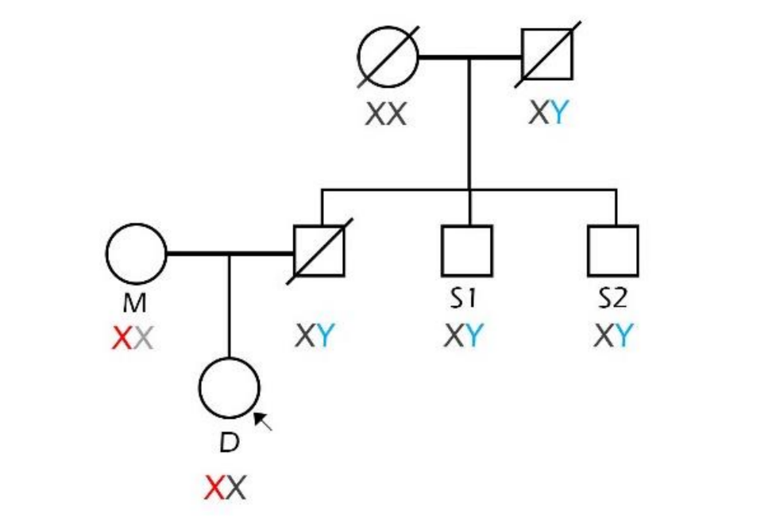

## Zadanie 3 (5b)

V tomto zadaní budete pracovať s nástrojom FamLinkX a datasetom **dna_screening_zadanie** dostupným v priečinku `inputs`. 

Dataset obsahuje údaje matky, dcéry a dvoch strýkov, ktorí sú bratmi muža, u ktorého predpokladáme, že je otcom dcéry. Je potrebné potvrdiť alebo vyvrátiť či bol muž otcom dievčaťa. Pomocou nástroja FamLinkX zostavte hypotézy s rodokmeňom členov, vykonajte analýzu, určte výsledné pravdepodobnosti hypotéz a uveďte výsledné rozhodnutie na potvrdenie/zamietnutie otcovstva.

### Úloha 1 (1b)

**Formulujte hypotézy pre riešenie úlohy:**

H1:  skúmaný chlap je biologicky otec  dievčaťa
H2: skúmaný chlap nie je biologický otec dievčaťa, ale otcom je nýhodný muž 

### Úloha 2 (4b)

Vykonajte analýzu pomocou nástroja FamLinkX. Ako referenčnú databázu použite Českú alebo Nemeckú databázu. Ako prílohu zadania odovzdajte vygenerovaný report z analýzy (Case report vo formáte .rtf). 

**Uveďte LR a pravdepodobnosť (W) pre jednotlivé hypotézy a Váš záver analýzy:**

Po zvoleni Pedigree  1 ( two aunts/uncles (data mother))
 a pedigree 2 ( mother and child full siblings)
 mi po importovani dat do spravnych osob vyslo , ze :
LR: 1
W(H1): 0.5
W(H2): 0.5
Kedze LR :1 tak nie je mozne uprednostnit ziadnu z hypotez. Nejde teda o dokaz alebo vyvratenie ani jednej hypoteze
Tu prikladam  export vysledkov do txt:
Output generated by FamLinkX version 2.9
Marker	LR (marginal)
DXS10148	1
DXS10135	1
DXS8378	1
DXS7132	1
DXS10079	1
DXS10074	1
DXS10103	1
HPRTB	1
DXS10101	1
DXS10146	1
DXS10134	1
DXS7423	1
Total LR	1
Database	 FamLinkX